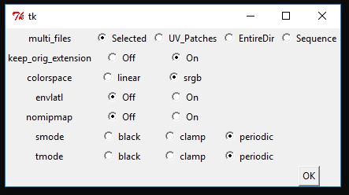

# tdl_gui
tdl_gui

python / tkInter GUI script to help generating 3delight TDL files.

Place tdl_GUI.bat into C:\Users\YOU\AppData\Roaming\Microsoft\Windows\SendTo

Right-click a texture file, and select SentTo -> tdl_GUI.bat

